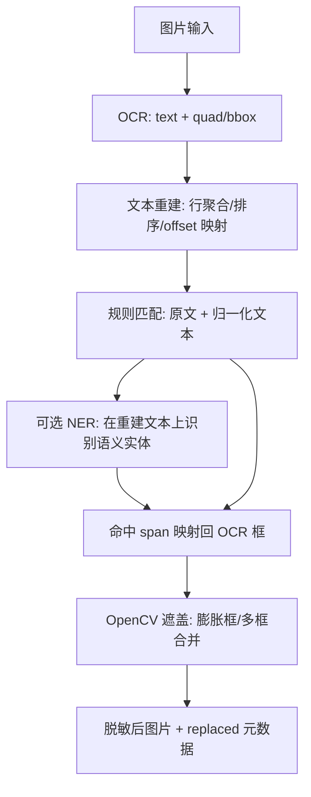

# 图片脱敏服务扩展方案 (Image Desensitization Extension)

> **状态**: Draft (Revised for weak L4T devices and OCR block fragmentation)  
> **创建日期**: 2026-08-06  
> **最近修订**: 2026-08-11  
> **关联项目**: desensitize  
> **目标**: 在现有文本脱敏服务基础上，扩展对图片、截图、扫描件中的敏感文字自动遮盖能力。

---

## 1. 背景与目标

现有 `desensitize` 服务已经支持：

- 纯文本规则脱敏；
- 可选 NER 增强；
- VOS 内通过 `vos_default` 网络访问；
- L4T/Thor/ARM CUDA/AMD CUDA/CPU 等多 profile 打包。

下一步图片脱敏的目标是：接收图片，识别图片中的文字，复用现有规则和可选 NER 能力，在原图上遮盖敏感区域，并返回脱敏后的图片。

图片脱敏的核心风险不是“能否 OCR 出文字”，而是 **OCR 输出经常被切成多个文本块**。RapidOCR 或其他 OCR 引擎都可能把一处敏感文本拆成多个对象，例如：

- 手机号：`138123` + `45678`；
- 身份证：`1101011990` + `01011234`；
- API Key：`sk-live-abc123` + `def456...`；
- 表格、截图、扫描件中的一行文字被拆成多个小框；
- 旋转、低清晰度、压缩图片导致字符间距异常。

如果按 OCR 文本块逐条执行正则，长规则会漏检。因此图片脱敏必须先做 **文本重建 + offset 到 bbox 的映射**，不能直接把 OCR 块丢给规则引擎。

---

## 2. OCR 引擎判断：暂不替换 RapidOCR

### 2.1 结论

当前阶段不建议把 RapidOCR 换成更重的 OCR 框架。推荐策略是：

1. **MVP 继续使用 RapidOCR + onnxruntime-gpu**；
2. 把主要工程投入放在 OCR 后处理：行聚合、阅读顺序恢复、归一化匹配、命中区域回映射；
3. 保留 OCR Engine 抽象接口，后续如果 tc232/Thor 上有更好的实测结果，再切换引擎；
4. tc192/l4t 上默认走保守配置：低并发、限制图片尺寸、优先保证规则脱敏服务稳定。

### 2.2 为什么不先换 OCR

| 选项 | 判断 | 原因 |
|------|------|------|
| RapidOCR + onnxruntime-gpu | 推荐 MVP | 依赖形态轻，和当前 NER 的 ONNX Runtime 体系一致；适合放进现有服务快速验证。 |
| PaddleOCR 全套 | 暂不推荐 tc192 首发 | 依赖和运行时更重，弱 Jetson 上安装、镜像体积、启动内存和并发风险更高。 |
| EasyOCR / PyTorch OCR | 不推荐首发 | PyTorch 栈更重，和当前 ONNX Runtime 模型复用不一致。 |
| 云 OCR / 外部 OCR 服务 | 不符合当前目标 | 图片本身可能含敏感信息，不能先发给外部服务再脱敏。 |
| 自己训练/重写 OCR | 不推荐 | 不是当前 desensitize 的核心价值，成本高，质量和跨平台风险不可控。 |

RapidOCR 断块不是 RapidOCR 独有问题，换 OCR 也不能保证一整串手机号/API Key 一定完整输出。正确解法是 **在 OCR 输出之后补一层文本布局恢复**。

---

## 3. 核心架构

图片处理流程改为四阶段：**OCR -> 文本重建 -> 脱敏匹配 -> 坐标遮盖**。



### 3.1 OCR 输出对象

内部统一成如下结构，不直接暴露 OCR 引擎原始返回：

```python
@dataclass
class OcrBlock:
    text: str
    quad: list[Point]          # OCR 原始四点框，优先保留；没有时再转 bbox
    bbox: Rect                 # axis-aligned fallback
    score: float
    line_id: int | None = None
    block_id: int | None = None
```

说明：

- 遮盖时优先使用 `quad`，可以更贴近旋转文字；
- 对截图、表格等普通文本，可以把多个 `quad` 合并成一个膨胀后的矩形；
- 低置信度块不直接丢弃，先进入重建流程，但可在最终命中时降低优先级。

---

## 4. 文本重建与断块修复

这是图片脱敏的关键模块。

### 4.1 行聚合

1. 按 OCR block 的中心 y、文本高度、倾斜角估算所属行；
2. 同一行内按 x 坐标排序；
3. 对高度差过大、角度差过大的 block 分到不同行；
4. 表格场景下允许一行内存在较大间隔，但不能因为间隔大就断开匹配链。

### 4.2 原始全文构建

对每一行生成 `line_text`，再拼成 `document_text`。构建时维护字符到 OCR block 的映射：

```python
@dataclass
class CharMap:
    doc_start: int
    doc_end: int
    block_id: int
    block_char_start: int
    block_char_end: int
```

插入空格/换行也要进入映射表，但标记为 synthetic。后续规则命中 synthetic 字符时，遮盖区域取左右真实字符所在 block。

### 4.3 归一化文本匹配

对长规则必须在 normalized text 上再跑一遍。归一化处理包括：

- 去掉空格、换行、制表符、全角空格；
- 去掉 OCR 常见分隔符：`-`、`_`、`.`、`·`、`:` 中的可选分隔；
- 统一全角/半角；
- 对容易 OCR 混淆的字符做可选弱归一化，例如 `O/0`、`I/l/1`，默认只用于高风险规则。

归一化时必须维护 `normalized_offset -> document_offset` 映射。规则命中后先回到 `document_text` offset，再映射到 OCR block。

### 4.4 分规则策略

| 规则类型 | 匹配文本 | 原因 |
|----------|----------|------|
| 手机号、身份证、银行卡 | normalized text | 高概率被空格/断块/换行切开。 |
| API Key、Token、JWT | normalized text + 原文 | 对断块敏感，同时要避免过度去符号导致误杀。 |
| 邮箱、URL | 原文 + 轻归一化 | 分隔符语义更强，不能粗暴删除所有符号。 |
| 密码字段、Bearer Header | 原文 | 依赖上下文关键词和空白结构。 |
| NER 人名/地址 | document text | NER 需要自然语言上下文，不应在 normalized text 上跑。 |

### 4.5 坐标回映射

命中规则返回的是 `[start, end)` 文本 span。回映射流程：

1. 找出 span 覆盖的所有 `CharMap`；
2. 聚合涉及的 OCR blocks；
3. 若命中只覆盖 block 的一部分，按字符比例估算局部 bbox；
4. 若命中跨多个 block，遮盖所有相关 block，并根据行关系合并：
   - 同一行相邻 block：合并成一个膨胀矩形；
   - 跨行 block：按行分别生成遮盖框；
5. 遮盖框做 2-4 px 或按字号比例的膨胀，避免边缘露字。

---

## 5. tc192/l4t 性能策略

### 5.1 资源判断

tc192 属于弱 L4T 环境，已经运行 VOS、Model Hub、NER、其他应用。图片 OCR 会比文本 NER 更吃瞬时 CPU/GPU/内存，不能按“100ms 无感”做承诺。

首版目标应是 **可控、稳定、不会拖垮服务**，不是追求最高吞吐。

### 5.2 默认限制

| 项目 | 建议默认值 | 说明 |
|------|------------|------|
| 最大图片边长 | 1600 px | 超过则等比例缩放，返回坐标按原图比例还原。 |
| 最大图片大小 | 8 MB | 防止超大截图/照片拖垮服务。 |
| OCR 并发 | 1 | tc192/l4t 默认只允许一个 OCR 推理任务。 |
| OCR 队列长度 | 2-4 | 忙时快速返回 429/503，避免堆积。 |
| NER + OCR 同时运行 | 默认串行 | OCR 请求中如启用 NER，先 OCR，再文本重建，再按同一个 GPU 信号量执行 NER。 |
| CPU fallback | 仅健康降级，不作为默认路径 | CPU OCR/NER 在弱设备上可能阻塞 API。 |

### 5.3 不采用复杂 CUDA Stream 调度

文档不应承诺应用层能强制中断 CUDA Stream 或抢占 NER 显存。ONNX Runtime 的现实可控手段是：

- 进程内 `Semaphore` 控制 OCR/NER GPU 并发；
- 排队等待 + 超时；
- 忙时返回“图片脱敏繁忙，请稍后”；
- NER 不可用时仅降级为规则脱敏，不影响 OCR 基础规则遮盖；
- OOM 后重建 OCR/NER session，必要时标记服务进入降级状态。

### 5.4 性能目标

首版不要写死 30-80ms。建议按实测分档：

| 场景 | 目标 |
|------|------|
| 小截图，720p 内，少量文字 | 0.3-1.0s |
| 普通截图，1080p，几十行文字 | 1-3s |
| 大图/扫描件/密集表格 | 允许 3s+，必要时返回繁忙或提示压缩图片 |

最终数字必须用 tc192、tc232、Thor 分别实测后再写进 README。

---

## 6. API 设计

### 6.1 `POST /api/v1/desensitize/image`

请求体：

```json
{
  "image_base64": "/9j/4AAQSkZJRgABAQAAAQABAAD...",
  "mime_type": "image/jpeg",
  "level": "standard",
  "ner": false,
  "return_coordinates": false,
  "max_side": 1600
}
```

暂不建议首版支持任意 `image_url`。如果后续支持，必须加：

- URL allowlist 或 VOS 内部地址限制；
- 下载大小限制；
- 超时限制；
- SSRF 防护。

响应体：

```json
{
  "image_base64": "/9j/4AAQSkZJRgABAQAAAQABAAD...",
  "mime_type": "image/jpeg",
  "replaced": [
    {
      "rule": "手机号 (中国)",
      "placeholder": "[PHONE_NUMBER]",
      "occurrences": 1,
      "spans": [{"start": 12, "end": 23}],
      "boxes": [
        {"x1": 100, "y1": 50, "x2": 220, "y2": 76}
      ],
      "quads": [
        [[100, 50], [220, 50], [220, 76], [100, 76]]
      ]
    }
  ],
  "metadata": {
    "ocr_engine": "rapidocr",
    "ocr_blocks": 42,
    "rebuilt_text_length": 860,
    "normalized_matching": true,
    "resized": true,
    "scale": 0.75
  },
  "latency_ms": 842.3
}
```

---

## 7. 实现模块

建议新增模块：

```text
app/services/image_ocr.py          # OCR engine wrapper, RapidOCR implementation
app/services/image_layout.py       # OCR block line grouping, text rebuild, offset mapping
app/services/image_matcher.py      # 原文/归一化文本规则匹配，复用现有 rule_store
app/services/image_masker.py       # bbox/quad 合并、膨胀、遮盖
app/routers/desensitize.py         # /api/v1/desensitize/image
```

接口抽象：

```python
class OcrEngine(Protocol):
    def detect(self, image: np.ndarray) -> list[OcrBlock]: ...

class ImageDesensitizer:
    def desensitize_image(self, image: np.ndarray, *, ner: bool = False) -> ImageResult: ...
```

RapidOCR 只是 `OcrEngine` 的一个实现。后续如果要替换 OCR，只需要替换 `detect()` 输出为统一 `OcrBlock`。

---

## 8. 验收用例

首版必须覆盖这些断块场景，不能只测完整 OCR 文本块。

| 用例 | 预期 |
|------|------|
| 手机号被拆成 `138123` + `45678` | 仍遮盖完整手机号区域。 |
| 身份证被拆成两段或中间有空格 | 仍遮盖完整身份证区域。 |
| API Key 被拆成 2-4 个 OCR block | 仍遮盖完整 key。 |
| 一行文本被 OCR 切成多个小框 | 行重建后规则仍命中。 |
| 表格中相邻单元格都有数字 | 不应把跨单元格无关数字误合并成手机号/银行卡。 |
| 倾斜/旋转小角度截图 | 使用 quad 或膨胀 bbox 后不露字。 |
| OCR 未识别或置信度过低 | 返回 metadata，不假装已脱敏。 |
| 图片过大 | 按 max_side 缩放处理，坐标还原正确。 |
| OCR 队列满 | 返回明确繁忙错误，文本规则服务不受影响。 |

---

## 9. 分阶段计划

| 阶段 | 内容 | 完成标准 |
|------|------|----------|
| Phase 0: tc192 基线 | 在 tc192 l4t 容器内验证 RapidOCR GPU/CPU 可用性，采集 720p/1080p/大图耗时。 | 有真实耗时、内存、GPU 采样记录。 |
| Phase 1: 后处理 MVP | 实现 OCR block -> rebuilt text -> normalized text -> span -> bbox 的闭环。 | 人工构造断块单测通过。 |
| Phase 2: API + 遮盖 | 增加 `/api/v1/desensitize/image`，支持 base64 图片输入和遮盖输出。 | 手机号/身份证/API Key 图片样例可遮盖。 |
| Phase 3: GPU/打包 | Dockerfile 增加 RapidOCR 依赖，按 profile 处理 ORT 安装。 | tc192/tc232 至少各一轮实际镜像测试。 |
| Phase 4: 文档与灰度 | 更新 README、接入指南、包内 README。 | VOS 内安装后可通过接口自测。 |

---

## 10. 当前决策

- **不重写 OCR，不先替换 RapidOCR。**
- **必须重写原方案中的匹配流程。** 逐 OCR block 直接正则匹配不安全。
- **tc192 默认保守运行。** OCR 并发 1、限制图片大小、忙时返回，不做复杂 CUDA Stream 抢占。
- **后续是否换 OCR 由实测决定。** 如果 RapidOCR 在 tc192 上 GPU 不稳定或准确率明显不够，再评估 PaddleOCR/TensorRT OCR，但引擎替换不能代替文本重建。
