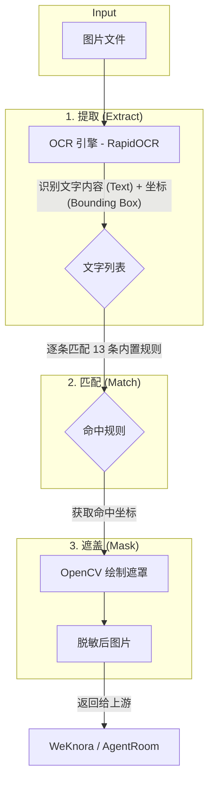
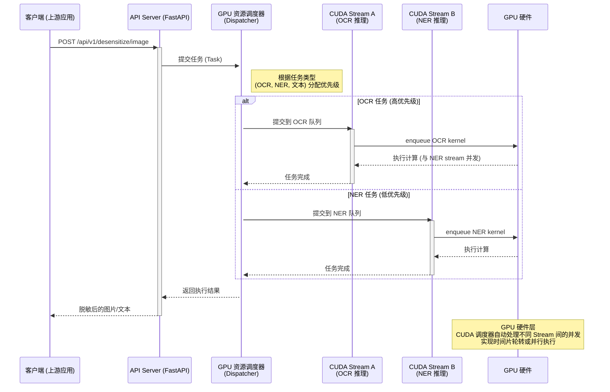

# 图片脱敏服务扩展方案 (Image Desensitization Extension)

> **状态**: Draft (Revised with OOM Handling)
> **创建日期**: 2026-08-06
> **关联项目**: desensitize
> **目标**: 在现有文本脱敏服务基础上，扩展对图片（截图、证件照等）的敏感信息（文字）自动遮盖能力。

---

## 1. 背景与目标

现有的 `desensitize` 服务提供了基于正则规则的文本脱敏能力。在实际应用场景中，用户常常会将包含敏感信息的图片（如：含有手机号的截图、包含密钥的文档扫描件、身份证/银行卡照片）直接上传给云端大模型。

**目标**：扩展 `desensitize` 服务，使其能够接收图片，自动识别图片中的文字，应用现有的 13 条脱敏规则，并在原图上遮盖命中的区域，最终返回脱敏后的图片。

**核心原则**：
1.  **轻量前置**：处理过程应尽可能快，对用户无感。
2.  **跨平台 GPU 加速**：必须兼容现有的部署架构（Jetson L4T, Jetson Thor, AMD + CUDA），并最大化利用各平台的 GPU 进行推理加速。
3.  **规则复用**：最大化复用现有的正则规则引擎，确保脱敏逻辑的一致性。

---

## 2. 核心技术架构

整体流程分为三个阶段：**提取 (Extract) -> 匹配 (Match) -> 遮盖 (Mask)**。



### 2.1 关键组件选型

为满足跨平台（ARM64/AMD64）和高性能要求，OCR 引擎的选择至关重要。经过调研，并参考 `emb_server` 的实现，选定 **RapidOCR + onnxruntime-gpu**。

| 组件 | 选型 | 理由 |
|------|------|------|
| **OCR 引擎** | **RapidOCR** | - **API 简洁**: Python 接口友好，易于与现有 FastAPI 服务集成。<br>- **性能优异**: 底层基于 PaddleOCR，配合 GPU 版 ONNX Runtime，在 Jetson 和 x86 平台都能获得极致的推理性能。 |
| **推理后端** | **onnxruntime-gpu** | - **GPU 加速**: 参考 `emb_server`，在 L4T/Thor 上通过特定源或 wheel 安装，在 AMD 平台直接安装，实现全平台 GPU 推理。 |
| **规则引擎** | **复用现有** | 直接调用 `rule_store.get_all_rules()`，实现逻辑 100% 复用。 |
| **遮盖工具** | **OpenCV** | 标准库，性能极高，支持复杂图形绘制。 |

---

## 3. 多平台部署方案（GPU 加速版）

为支持三种 profile 并启用 GPU 加速，我们根据不同平台的特性，采用不同的 `onnxruntime-gpu` 安装策略。

### 3.1 平台特定依赖安装

#### A. Jetson L4T / Orin 平台 (ARM64)
参考 `modules/emb_server/Dockerfile_l4t` 的实现，通过 Jetson 官方维护的 PyPI 源安装。
```dockerfile
# Jetson Orin/L4T 专用 pip 源
ARG JETSON_PYPI_URL="https://pypi.jetson-ai-lab.io/jp6/cu129/+simple"

# 安装 GPU 版 onnxruntime
RUN pip3 install --no-cache-dir --break-system-packages \
    numpy==1.26.4 \
    onnxruntime-gpu \
    --index-url ${JETSON_PYPI_URL} \
    --trusted-host pypi.jetson-ai-lab.io
```

#### B. Jetson Thor 平台 (ARM64)
参考 `modules/emb_server/Dockerfile_thor` 的实现，使用预先编译好的 wheel 文件。
```dockerfile
# 假设 wheel 文件已在构建上下文的 modules/ 目录中
COPY modules/onnxruntime_gpu-*.whl /tmp/

# 安装 GPU 版 onnxruntime
RUN pip3 install --no-cache-dir --break-system-packages \
    numpy==1.26.4 \
    /tmp/onnxruntime_gpu-1.27.0-cp312-cp312-linux_aarch64.whl
```

#### C. AMD + CUDA 平台 (x86)
直接使用标准 PyPI 源安装。
```dockerfile
# AMD x86 平台
RUN pip3 install --no-cache-dir --break-system-packages \
    numpy==1.26.4 \
    onnxruntime-gpu
```

### 3.2 Dockerfile 完整逻辑示例

```dockerfile
FROM dustynv/pytorch:2.7-r36.4.0-cu128-24.04 # or your base image

ARG TARGETPLATFORM
ARG PROXY

# 通用依赖
RUN pip install --no-cache-dir opencv-python-headless pillow

# 平台特定 OCR 依赖 (动态判断)
RUN set -e; \
    if [ "$TARGETPLATFORM" = "linux/arm64" ]; then \
        echo "Installing onnxruntime-gpu for ARM64 (Jetson)..."; \
        # 使用 Jetson 源或 wheel 安装，具体逻辑根据 L4T/Thor 版本调整
        pip install --no-cache-dir onnxruntime-gpu \
          --index-url https://pypi.jetson-ai-lab.io/jp6/cu129/+simple \
          --trusted-host pypi.jetson-ai-lab.io; \
    else \
        echo "Installing onnxruntime-gpu for AMD64..."; \
        pip install --no-cache-dir onnxruntime-gpu; \
    fi; \
    pip install --no-cache-dir rapidocr-onnxruntime

# ... 其余应用代码和启动逻辑 ...
```

### 3.3 GPU 资源管理策略

由于 `desensitize` 服务现已支持 NER (GPU) 和 OCR (GPU) 两种 GPU 密集型任务，必须设计合理的资源管理策略以避免争抢和 OOM (Out Of Memory)。

**策略**: **CUDA Streams 并发** + **优先级调度队列** + **动态降级与退避机制**

#### 交互时序图
为了更清晰地展示资源调度流程，我们使用 Mermaid 绘制时序图：



#### 优先级决策与 OOM 降级流程图 (GPU 高负载/显存不足场景)
当 GPU 负载过高或发生 OOM 时，调度器的决策逻辑将更为复杂。以下流程图详细展示了 OCR 和 NER 任务在显存紧张时的处理逻辑，特别是低优先级任务的退避机制。

```mermaid
graph TD
    subgraph "调度器接收任务"
        A["任务到达"] --> B{"判断任务类型"};
    end

    subgraph "GPU 负载与显存检查"
        B -- "OCR 任务 高优先级" --> C1["标记为高优先级"];
        B -- "NER 任务 低优先级" --> C2["标记为低优先级"];
        C1 --> D{"检查 GPU 状态"};
        C2 --> D;
        
        D -- "负载低且显存充足" --> E["直接提交到对应的 CUDA Stream"];
        D -- "负载高或显存紧张" --> F{"进入高负载调度"};
    end

    subgraph "高负载调度与降级策略"
        F -- "OCR 任务" --> G{"强制高优先级处理"};
        G --> H{"显存是否足够?"};
        H -- "足够" --> I["立即执行 OCR"];
        H -- "不足 OOM 风险" --> J["触发 NER 强制卸载/挂起"];
        J --> K["释放 NER 占用的显存"];
        K --> I;
        
        F -- "NER 任务" --> L{"低优先级队列等待"};
        L --> M{"等待策略"};
        
        subgraph "NER 任务退避与降级机制"
            M -- "等待超时 如 >5s" --> N{"判断降级策略"};
            N -- "策略 1 延迟重试 推荐" --> O["返回服务繁忙请稍后重试<br>通知上游"];
            N -- "策略 2 临时降级到 CPU" --> P["将 NER 模型迁移至 CPU Stream<br>或使用更小的模型"];
            P --> Q["在 CPU 上执行推理速度慢"];
            Q --> R["完成后释放资源"];
        end
    end
    
    subgraph "执行与反馈"
        E --> S["CUDA Stream 执行推理"];
        I --> S;
        O --> T["任务被拒绝或延迟"];
        Q --> T;
        
        S --> U["推理完成"];
        U --> V["释放显存资源"];
        V --> W["调度器通知下一个等待任务或恢复被挂起的 NER 队列"];
        
        T --> X["调度器状态更新"];
        X --> W;
    end

    style J fill:#fdd,stroke:#a33,stroke-width:2px
    style O fill:#fdf,stroke:#840,stroke-width:2px
    style P fill:#dfd,stroke:#282,stroke-width:2px
    style U fill:#ccf,stroke:#333,stroke-width:2px
```



**流程图解析与策略说明**:
1.  **初始分流**: 任务到达调度器后，根据类型标记优先级。
    -   **OCR 任务**: **高优先级，永不阻塞**。它代表用户实时体验，必须被优先保障。
    -   **NER 任务**: **低优先级，可被抢占**。它是后台增强能力，可以被临时挂起或降级。

2.  **高负载调度 (OOM 场景)**:
    -   **OCR 遇阻**: 当 OCR 任务因显存不足而无法启动时，调度器会**强制介入**。
    -   **强制卸载/挂起 NER**: 调度器会立即中断正在 GPU 上运行的 NER 任务（通过同步或强制终止其 CUDA Stream），释放其占用的显存，让给 OCR 任务。这是安全的，因为 NER 被设计为可中断的。

3.  **低优先级任务 (NER) 的退避与降级机制**:
    当 NER 任务无法获得 GPU 资源时，它不会无限等待，而是执行以下策略之一：
    -   **策略 1: 延迟重试 (Graceful Degradation, 推荐)**
        -   **行为**: 当 NER 任务在队列中等待超过预设时间阈值（如 5 秒），或者明确收到 GPU 显存不足的信号时，调度器会主动通知上游调用方：“服务繁忙，请稍后重试”。
        -   **优点**: 避免了无效的资源消耗，上游应用可以选择放弃 NER 增强，或者将任务存入异步队列稍后处理。
    -   **策略 2: 临时降级到 CPU (CPU Fallback)**
        -   **行为**: 作为兜底方案，如果 GPU 完全不可用，调度器可以将 NER 模型临时迁移到 CPU 上执行（`CPUExecutionProvider`），或者在 CPU 上加载一个更小的、精度稍低的备用模型。
        -   **优点**: 保证了服务的可用性，即使速度慢（可能从 40ms 降到 500ms），也能完成脱敏任务。
        -   **缺点**: 占用 CPU 资源，可能影响 FastAPI 服务本身的响应速度。

通过这种“**高优先级保障 + 低优先级动态退避/降级**”的弹性策略，可以确保服务在极端负载下依然稳定，核心功能（OCR 脱敏）始终可用。

#### 策略解析：
1.  **CUDA Streams 并发**:
    -   **Stream A (OCR)**: 专门用于 OCR 模型的推理任务。
    -   **Stream B (NER)**: 专门用于 NER 模型的推理任务。
    -   **原理**: CUDA 允许在不同的 Stream 中并发执行操作。我们为 OCR 和 NER 任务创建独立的 Stream，使得 GPU 硬件可以在这两个任务之间进行时间片轮转或真正的并行执行（如果有足够的计算单元），从而最大化 GPU 利用率。

2.  **优先级调度队列**:
    -   在应用层，为不同类型的任务设置优先级。例如，**OCR 任务**的优先级可以设为**高**，因为它通常是用户无感的前置操作，对实时性要求高。而 **NER 任务**可以设为**低**，作为后台增强能力。
    -   **调度器 (Scheduler)**: 作为 GPU 任务的唯一入口。当请求到来时，调度器根据任务类型和当前 GPU 负载（通过简单的计数器或状态标志）决定：
        -   **立即执行**: 如果对应 Stream 空闲或负载低，直接提交任务。
        -   **排队等待**: 如果 GPU 负载高，将任务放入对应 Stream 的队列中，等待前面的任务完成后再执行。

3.  **动态退避与降级机制 (OOM Protection)**:
    -   这是保障服务稳定性的关键。当 GPU 显存不足时，高优先级的 OCR 任务不应受到影响，而低优先级的 NER 任务必须具备自我牺牲的能力。通过强制卸载、延迟重试或 CPU 降级等机制，实现了服务在极端场景下的优雅降级。

通过这种“物理隔离 (Stream) + 逻辑调度 (Queue) + 异常保护 (OOM Fallback)”的组合策略，可以在保证高优先级任务低延迟的同时，充分利用 GPU 的并发能力，并确保服务在任何负载下都能稳定运行。

---

## 4. API 设计

在现有 FastAPI 应用中新增一个图片处理端点。

### 4.1 `POST /api/v1/desensitize/image`

**请求体** (两种模式):

**模式 1: 直接上传 Base64 图片**
```json
{
  "image_base64": "/9j/4AAQSkZJRgABAQAAAQABAAD...",
  "level": "standard",
  "return_coordinates": false // 可选，是否返回遮盖坐标
}
```

**模式 2: URL 引用图片**
```json
{
  "image_url": "http://example.com/path/to/sensitive_image.jpg",
  "level": "standard"
}
```

**响应体**:
```json
{
  "image_base64": "/9j/4AAQSkZJRgABAQAAAQABAAD...", // 脱敏后的图片
  "mime_type": "image/jpeg",
  "replaced": [
    {
      "rule": "手机号 (中国)",
      "occurrences": 2,
      "coordinates": [ // 仅在 return_coordinates=true 时返回
        {"x1": 100, "y1": 50, "x2": 200, "y2": 70},
        {"x1": 300, "y1": 150, "x2": 400, "y2": 170}
      ]
    }
  ],
  "latency_ms": 85.2 // GPU 加速后，延迟将显著降低
}
```

---

## 5. 性能与资源预估 (Jetson Orin, GPU 模式)

基于 RapidOCR + onnxruntime-gpu 的预估性能（相比 CPU 模式将有数倍提升）：

| 指标 | 预估数值 | 备注 |
|------|---------|------|
| **单张图片处理延迟** | **30 - 80 ms** | 取决于图片分辨率和文字密度 |
| **OCR 延迟 (GPU)** | ~20 ms | GPU 加速后，OCR 推理速度将大幅提升 |
| **遮盖延迟** | ~10 ms | OpenCV 绘制遮罩极快 |
| **规则匹配延迟** | ~5 ms | 复用现有规则引擎 |
| **GPU 占用** | **高** | OCR 和 NER 将共享 GPU 资源，需配合 CUDA Streams 调度 |
| **内存增量** | ~500 MB | RapidOCR + onnxruntime-gpu 库及模型加载 |

**结论**: GPU 加速后，单张图片处理延迟可压缩至 **100ms 以内**，完全达到“丝滑无感”的用户体验。

---

## 6. 开发与实施计划

| 阶段 | 任务 | 交付物 |
|------|------|--------|
| **Phase 0: 环境验证** | 1. 在 L4T/Thor 机器上验证 `onnxruntime-gpu` 安装。<br>2. 验证 RapidOCR 在 GPU 模式下的推理可用性和性能。 | 验证脚本和性能基线数据 |
| **Phase 1: 核心实现** | 1. 集成 RapidOCR (GPU 模式)。<br>2. 实现图片 -> 文字 -> 遮盖的核心逻辑。<br>3. 实现 GPU 资源管理 (CUDA Streams)。<br>4. 实现 OOM 降级与 NER 退避机制。<br>5. 实现 FastAPI 端点。 | `image_engine.py`, 资源管理模块, OOM 处理器, API |
| **Phase 2: 适配与测试** | 1. 调整 Dockerfile 适配 ARM64/AMD64。<br>2. 在 Thor/AMD 机器上分别构建和测试。<br>3. 编写自动化测试 (CI)。 | 更新的 `docker-compose.yml`, 测试报告 |
| **Phase 3: 灰度与集成** | 1. 在开发环境灰度开启图片脱敏。<br>2. 与 WeKnora 应用联调。<br>3. 更新接入文档。 | 更新的产品文档 |

---

## 附录 A: 安装与验证命令

**Jetson L4T/Orin 验证:**
```bash
# 1. 安装 onnxruntime-gpu
pip install onnxruntime-gpu --index-url https://pypi.jetson-ai-lab.io/jp6/cu129/+simple --trusted-host pypi.jetson-ai-lab.io

# 2. 验证 GPU 是否可用
python3 -c "import onnxruntime as ort; print(ort.get_available_providers())"
# 预期输出: ['CUDAExecutionProvider', 'CPUExecutionProvider']

# 3. 验证 RapidOCR 是否能使用 GPU
# (需先安装 rapidocr-onnxruntime)
python3 -c "
from rapidocr_onnxruntime import RapidOCR
# 如果初始化成功且没有报错，说明 GPU 模式可用
ocr = RapidOCR(providers=['CUDAExecutionProvider', 'CPUExecutionProvider'])
print('OCR initialized successfully!')
"
